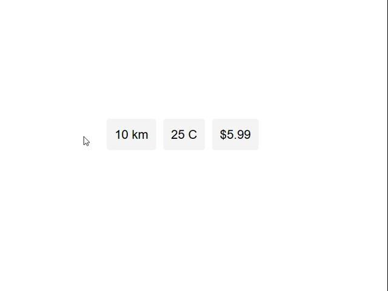

# Hover Convert

Hover Convert is a lightweight Chrome extension for instant unit, currency, and temperature conversions while browsing.  
Just highlight a value (like `10 km`, `$5.99`, or `30 °C`) and the conversion will instantly appear in a tooltip above your selection.




## ✨ Features

- 🌍 **Unit Conversions** — Metric & imperial units (`meters`, `miles`, `inches`, `kg`, `lb`, `oz`, etc.)
- 💱 **Real-time Currency Exchange** — Powered by [Fawaz Ahmed’s Exchange API](https://github.com/fawazahmed0/exchange-api)
- 🌡️ **Temperature Conversions** — Convert between `°C`, `°F`, and `Kelvin`
- ⚡ **Instant Tooltips** — No calculator or extra tab needed
- 🎯 **Smart Parsing** — Handles formats like `5 km`, `€ 9.99`, `10 lbs`, etc.
- 🖥️ **Browser Support** — Works on Chrome, Edge, Brave, and other Chromium-based browsers
- ⚙️ **Customizable Target Currency** — Choose your preferred currency in the options page


## 🚀 Installation

1. Clone or download this repository:
   ```bash
   git clone https://github.com/KalinKolev11/hover-convert.git
   ```
2. Open your Chrome-based browser and go to **Extensions**  
3. Enable **Developer Mode**  
4. Click **Load Unpacked** and select the project folder  
5. ✅ Done!
    
## ⚙️ Usage

- Highlight any **number + unit/currency** on a webpage  
- A tooltip will appear with the converted value  
- Works with numbers containing commas, decimals, or currency symbols  


## 🙏 Acknowledgements

- [Free Currency Exchange Rates API](https://github.com/fawazahmed0/exchange-api)  

## 📜 License

This project is licensed under the MIT License. See [LICENSE](LICENSE) for details.